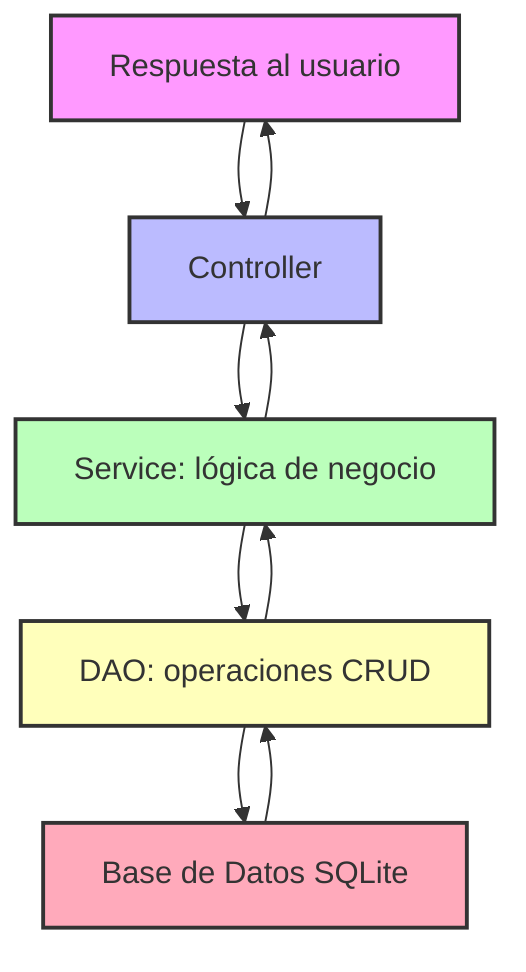

# 🚀 ABM de Contactos – Proyecto Profesional

## 📌 Descripción General

El proyecto **ABM de Contactos** es un sistema de gestión de contactos desarrollado en **Python**, aplicando **Programación Orientada a Objetos (POO)**, con interfaz CLI y persistencia de datos en **SQLite**.

Este desarrollo tiene un enfoque profesional y escalable, aplicando **principios SOLID, modularidad y documentación formal**, simulando el flujo completo de trabajo en un proyecto real de software.

El sistema permite:

- Alta, baja, modificación y consulta de contactos.
- Persistencia en SQLite + exportación de datasets.
- Arquitectura modular con separación por capas.
- Documentación UML y manual de usuario.

Cada integrante del equipo recorre **el ciclo completo de desarrollo**, incluyendo diseño de base de datos, definición de clases y objetos, conexión con GUI y documentación.

---

## 🎯 Objetivos del Proyecto

1. Diseñar un sistema ABM escalable y modular con POO en Python.
2. Crear una interfaz funcional (CLI) para la interacción con el usuario.
3. Implementar persistencia de datos en SQLite con operaciones CRUD.
4. Aplicar buenas prácticas profesionales: SOLID, modularidad y documentación.
5. Documentar clases, métodos y flujos de datos.
6. Generar experiencia profesional para CV y LinkedIn.

---

## 🗂 Estructura del Repositorio

```text
ABM-Contactos/
│── docs/                         # Documentación profesional
│   └── diseño.md                 # UML, diagramas, manual
│
│── src/                          # Código fuente modular
│   │── __init__.py
│   │
│   ├── core/                     # Clases base y modelos abstractos
│   │   ├── __init__.py
│   │   ├── base_model.py         # Clase BaseModel
│   │   └── auditable_model.py    # Clase AuditableModel
│   │   └── base_dao.py.py        # Clase DAO
│   │
│   │
│   ├── models/                   # Entidades principales
│   │   ├── __init__.py
│   │   ├── contacto.py
│   │
│   ├── services/                 # Lógica de negocio
│   │   ├── __init__.py
│   │   ├── contacto_service.py
│   │
│   ├── controllers/              # Coordinación entre GUI y Services
│   │   ├── __init__.py
│   │   └── contacto_controller.py
│   │
│   ├── gui/                      # CLI profesional
│   │   ├── __init__.py
│   │   ├── menu.py
│   │   └── contacto_menu.py
│   │
│   ├── dao/                     # Persistencia y operaciones CRUD
│   │   ├── __init__.py
│   │   └── contacto_dao.py
│   │
│   └── config/                   # Configuración y base de datos
│       ├── __init__.py
│       └── db.py
│
│── scripts/                      # Scripts de inicialización y ayuda
│   ├── init_db.py
│   └── seed_data.py
│
│── .gitignore
│── README.md
└── requirements.txt
````

---

## 🛠️ Tecnologías

* Python 3.x
* SQLite
* UML (documentado en `/docs`)

---

## 🏗 Arquitectura del Sistema

El sistema se basa en una arquitectura **modular y escalable**, con capas bien definidas:

* **Capa de GUI (CLI):** `src/gui/contacto_menu.py` muestra opciones y captura inputs del usuario.
* **Capa de Controller:** coordina la comunicación entre GUI y Services (`src/controllers/`).
* **Capa de Services:** implementa la lógica de negocio y validaciones (`src/services/`).
* **Capa de DAO:** ejecuta operaciones CRUD sobre SQLite (`src/daos/`).
* **Modelo de Datos:** las clases `Contacto`, `Grupo`, `Historial` representan entidades y encapsulan su lógica.

---

## 🌐 Flujo de Datos – Circuito Completo



### 🔹 Explicación del Flujo

1. **Usuario:** interactúa con el menú CLI (`src/gui/contacto_menu.py`).
2. **Controller:** recibe inputs de la GUI y coordina los servicios (`src/controllers/contacto_controller.py`).
3. **Service:** aplica reglas de negocio y validaciones (`src/services/contacto_service.py`).
4. **DAO:** realiza las operaciones CRUD sobre SQLite (`src/daos/contacto_dao.py`).
5. **Base de Datos:** almacena de forma persistente los datos (`src/config/db.py`).

> Los resultados retornan desde la base de datos hacia la GUI pasando por DAO → Service → Controller → Usuario.

---

## ⚙ Instalación y Ejecución

Sigue estos pasos para poner en marcha la aplicación en tu entorno local:

1. Clonar el repositorio:

```bash
git clone https://github.com/emmaSDNZ/sistema-abm-de-contactos.git
cd sistema-abm-de-contactos
```

2. Crear y activar un entorno virtual:

```bash
python -m venv venv

# Linux / Mac
source venv/bin/activate

# Windows
venv\Scripts\activate
```

3. Instalar las dependencias:

```bash
pip install -r requirements.txt
```

4. Inicializar la base de datos:

```bash
python scripts/init_db.py
```

5. Ejecutar la aplicación:

```bash
python main.py
```

---

## 📊 Diagramas y Documentación

* **Diagramas UML:** Diagramas de clases, secuencias y flujo de datos en `docs/diagramas/`.
* **Informe de Diseño:** Documento con arquitectura y decisiones de diseño en `docs/informe.pdf`.
* **Manual de Usuario:** Guía de utilización del sistema en `docs/manual_usuario.pdf`.

---

## 📂 Roles de Integrantes

Cada integrante desarrolló un módulo completo siguiendo este flujo:

1. Diseño UML y modelo de datos.
2. Implementación de clases y lógica de negocio.
3. Conexión con base de datos.
4. Integración con GUI.
5. Documentación completa del módulo.

**Integrantes:**

* Isaias Emanuel Sudañez [GitHub](https://github.com/emmaSDNZ)
* Joaquín Pedrone Pfeiffer
* Christian Quispe
* Nombre4
* Nombre5
* Nombre6

Tecnicatura en Ciencias de Datos e Inteligencia Artificial, 

Instructor: Alejandro Mainero

```

